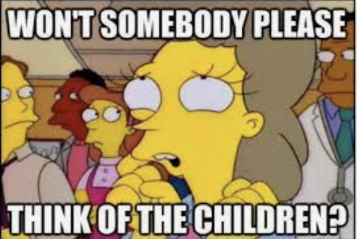

# It's all going to shit

The UK, Australia, many US states, France and probably more countries than I can remember have been introducing age-verification laws forcing social media companies to require their users to verify their age, often using insecure and untrustworthy third parties with dubious affiliations. I am reminded of [this ArsTechnica article about how "Windows Recall demands an extraordinary level of trust that Microsoft hasn't earned](https://arstechnica.com/ai/2024/06/windows-recall-demands-an-extraordinary-level-of-trust-that-microsoft-hasnt-earned/). Same thing here. Have these third-parties earned our trust to manage and hold face scans and government IDs?

No.

But now, [they're going after operating systems](https://www.tomshardware.com/software/operating-systems/california-introduces-age-verification-law) which is absolutely insane.

At least with social media they had an excuse

Now what is it? Are children going to be traumatized by the possibility of using a computer at all? Or ar we pivoting back to terrorism as an excuse? Or is the angle to not even pretend it's anything but mass surveillance on taxpayer dime but they're forcing companies into compliance so who cares what the public thinks?

If you live in California, please remember the names of all the people who voted yes: "*The bill passed both chambers unanimously, 76-0 in the Assembly and 38-0 in the Senate.*". A terrifying prospect.

The U S of A can only remain the land of the free, if the braves that name it home dare speak up against this. This is a **disease** that will keep spreading to the rest of the US, and then the world.

It's hard to tell exactly how this will affect Linux, but it's clear that nothing is sacred, noone is safe, and we need to fight against these surveillance schemes.