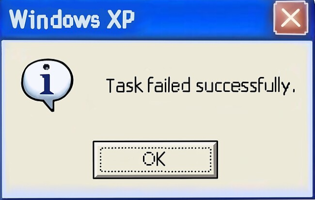

# Lustre is fantastic
which is why it is my framework of choice when building [Asterism](https://github.com/guillheu/asterism). I decided to build this OTP visualizer as a learning opportunity to understand how the BEAM works and supervisors and GenServers and all that jank.

Because I wanted to display information about the BEAM node itself, it made sense to server-render this Lustre project. This is achievable by using [Lustre Server Components](https://blog.guillheu.dev/articles/gaining-lustre/). On the BEAM node I would simply run a Mist server and serve the Lustre runtime on one hand, and handle the Lustre application state through a websocket endpoint, [as is suggested in the Lustre docs](https://lustre.hexdocs.pm/guide/05-server-side-rendering.html). So far, nothing out of the ordinary.

I heavily recommend reading [the Gnome Village article](https://happihacking.com/blog/posts/2025/the-gnome-village/) if some of the concepts I will bring up are confusing.

## A little bit of foreshadowing

Every BEAM process has a sort of mailbox through which it receives messages. OTP GenServers (which are similar to Gleam Actors) enforce a looping structure where the user supplies one (or several in the case of gen servers) message handler functions. This means every message is processed sequentially within a GenServer or Gleam Actor.

Here's what Claude made to represent this process:
```
     CALLER                     GENSERVER (state: 4)

 +-------------+             +-------------------------+
 | call(:incr) |------------>| mailbox                 |
 +-------------+             | [ :incr ][ msg B ]      |
        |                    +-------------------------+
        |                                 |
     (waits)                              v
        |                    +-------------------------+
        |                    | handle :incr            |
        |                    | state 4 -> 5            |
        |                    +-------------------------+
        |                                 |
        |       reply: 5                  |
        |<--------------------------------+
        v                                 v
 +-------------+             +-------------------------+
 |   gets 5    |             | wait for next message   |
 +-------------+             +-------------------------+
 ```

## I was just minding my business when suddenly...
Asterism builds a forest of BEAM processes currently running on the local BEAM node. I was implementing a way to identify whether a process was a supervisor or not. This is *technically* not a BEAM behavior, but an OTP behavior. Supervisors are part of the OTP supervisor module, and as explained above, they are a kind of GenServer with a message handler loop. They read messages sequentially.

To determine if a process is a supervisor, first I check if the process info has a supervisor signature, then I send a message to that process, asking it "Hey, are you a supervisor as specified in OTP?", and wait for a reply.

So, to check which of ALL processes are supervisors, I need to send a message to ALL processes that look like a supervisor at first glance. I was doing this in my Lustre application's `init` function...

... and this was a grave mistake.

I came to find out that a Lustre server component's `init` function will run in the `mist_factory_supervisor$<id>` process. This makes sense after all, since the Lustre application is initialized when I open the websocket connection, itself managed by mist.

This means that it's this same `mist_factory_supervisor` process that will send a message to every process that looks like a supervisor.

And of course, that means it'll send a message to itself and wait for a reply...

... and wait...

... and wait...
```
      SUPERVISOR              SUPERVISOR (same process)

 +------------------+        +-------------------------+
 | which_children() |------->| mailbox                 |
 +------------------+        | [ :which_children ]     |
          |                  +-------------------------+
          |                               |
       (waits)                            X  nobody free to read it
          |                               :
          |                  + - - - - - - - - - - - - +
          |                  : handle :which_children  :
          |                  : (never runs)            :
          |                  + - - - - - - - - - - - - +
          |                               :
          |      reply (never sent)       :
          |<- - - - - - - - - - - - - - - +
          v
 +------------------+
 |  waits forever   |
 | timeout=infinity |
 +------------------+
```

*In practice the supervisor doesn't actually hang indefinitely. The BEAM detects the self-message sending and simply crashes the supervisor instead.*

It will never send a reply to itself, because it's already busy handling a message. It can only reply to itself when it's done with the current message, and the current message can only continue when it gets a reply...

Chicken and egg...

This meant that whenever I was trying to scan every process and look for supervisors, I was inadventantly sending messages from a supervisor which crashed while messaging itself.

## Then I got a hunch

I figured that, since mist was using a supervisor, it was possibly creating a worker for every websocket connection (I'm not 100% certain of the process granularity).

And, I thought, if my Lustre app's `init` function is running on the supervisor, maybe the `update` function would run on that worker instead. It would make sense. Why would a supervisor run the message handling loop of its workers? No, it wouldn't, and the `update` function certainly is part of the message handling loop.

Next question is, how do I move this entire process from the `init` function to the `update` function?

By using [Lustre side-effects](https://lustre.hexdocs.pm/guide/03-side-effects.html)

### Lustre Side-effects
Lustre side-effects are meant to allow for non-UI-blocking updates to your Lustre app, for instance calling an API, or to first display a loading screen while the page is being put together by the server. They work is by running a function "on the side" (whatever that means I'm not sure I'm not a JS scientist) and dispatch a message back to the update function when it's done.

At first I tried running the supervisor-checking functions in the side-effect itself, but sadly saw the same issue. It seems that a side-effect, while non-blocking for the UI, will still run within whatever process returns them, so to speak. An init function retuning a side-effect will run that side-effect in the same process as the init function itself (again, not 100% sure but it sure looked that way).

But then I realized that we're not actually interested in the non-blocking update thing. I can simply use an empty side-effect that dispatches a plain message saying "I'm done initializing, handler loop can now take over". This allows us to send a message to the `update` function the moment that the initialization is finished, and *then* the `update` function itself, running in the worker, can get started sending all those messages to all supervisors.

### Isn't there any other way to do this?
Maybe, but I don't think so. To my knowledge, side-effects are the only way to essentially trigger something to run right after initialization from within the `update` function and outside the `init` function.

### Wouldn't the worker send a message to itself as well?
If I was blindly sending messages to every process, then yes that could've been a problem. But I do have an extra filtering step before I send that message, where I check the process info for a typical supervisor signature (checking a process' info does not send a message to that process). Since the mist worker is not a supervisor, it does not have that typical supervisor signature, and will not send a message to itself.

## The moral of the story
This was quite a tricky thing to troubleshoot, but in the end, this project is working. I wanted to learn about BEAM processes and OTP and messages and all of that by building Asterism, and this is one of the several instances where I hit my head against a wall and had to learn the hard way how it all works under the hood. 




## AI Disclosure
LLMs were used to make this blog post:
- to generate the GenServer ASCII diagrams